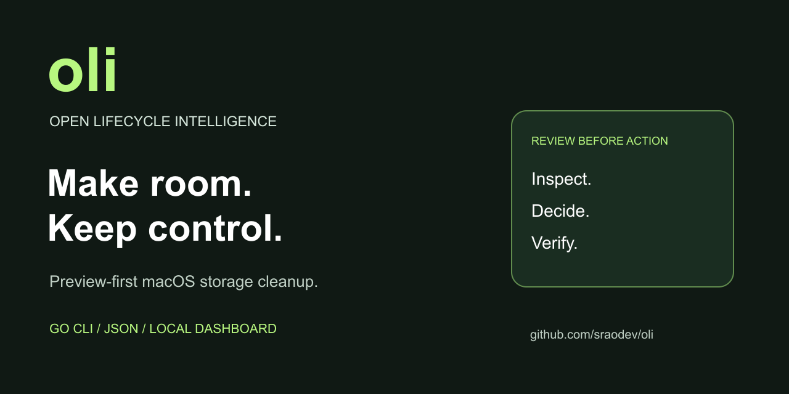

# Oli - Open Lifecycle Intelligence

Open Lifecycle Intelligence — preview-first macOS cleanup for people, scripts, and local agents.

[](https://github.com/sraodev/oli/actions/workflows/ci.yml)
[](LICENSE)

[Features](#what-does-oli-do) · [Install](#install-oli) · [Usage](#usage-options) · [Agent contract](docs/agent-interface.md) · [Contribute](CONTRIBUTING.md)



Oli is a **Go cleanup CLI for macOS**, with an optional local web dashboard.
Inspect disk usage, preview eligible files, and decide what to remove.
No account, subscription, telemetry, or `sudo`.

## What does Oli do?

### Preview and clean

- Old user cache files and logs in allowlisted home-directory locations.
- Default Homebrew, pip, Yarn, CocoaPods and Composer caches under `~/Library/Caches`.
- Xcode DerivedData; archives are inspection-only.
- npm's download cache, Gradle caches, Android cache and pyenv download cache.
- Go module **download cache**, not the whole module tree or Go build cache.
- Minecraft logs/crash reports, Steam logs, Lunar Client logs, Cacher logs and Kite logs.
- PhpStorm and Teams logs/caches only where covered by the generic user log/cache roots.
- The current user's `~/.Trash`, only through an explicitly selected rule; emptying is permanent.

Coverage is limited to known locations, not every app version or custom cache path.
Generic caches/logs have a 30-day modification gate; DerivedData has seven days.
Developer caches and app-specific logs require manual rule selection and a
30-day gate. Old does not necessarily mean unused—close affected apps and review first.

### Inspect without deleting

- iOS device backups, legacy iOS app packages and Xcode archives.
- Selected Adobe, Steam, Lunar Client and legacy Dropbox caches.
- Personal folders, ranked folder sizes and large/old files through Storage Atlas.
- Estimated bytes and recommendations through the CLI, versioned JSON or local dashboard.

See the [complete coverage table](docs/guides/cleanup-coverage.md) for exact rules
and limitations. System-wide logs, all-volume Trash, simulator resets, old gem
removal and Docker pruning are **not implemented**. Poetry's default cache is
protected because it can contain virtual environments. RAM purging is intentionally excluded.

> [!WARNING]
> Oli is early-stage software. Applied cleanup permanently deletes files; it
> does **not** move them to Trash or provide recovery. Review exact paths and
> read the [safety model](docs/safety.md) before applying anything.

## Install Oli

**CLI first · macOS · Apple Silicon and Intel.** Build from source today.
Installer and packaging source is merged in [#76](https://github.com/sraodev/oli/pull/76),
but no binary release is published yet. A merged installer is not a live install channel.

| Method | Availability | Tracking |
| --- | --- | --- |
| Build from source | Available on macOS; commands below | [Build guide](docs/guides/installation.md#build-from-a-reviewed-checkout-now) |
| Checksummed binary archives | Packaging implemented; publication and downloaded-byte verification pending | [#8](https://github.com/sraodev/oli/issues/8) |
| Curl installer | Source available; public installation pending a verified release | [#44](https://github.com/sraodev/oli/issues/44) |
| mise | Planned; no validated install command yet | [#46](https://github.com/sraodev/oli/issues/46) |
| Homebrew tap | Planned; no validated tap command yet | [#45](https://github.com/sraodev/oli/issues/45) |
| Stable HTTPS installer URL | Planned; no endpoint advertised | [#77](https://github.com/sraodev/oli/issues/77) |

### Step-by-step install from source

Requires macOS and the Go version declared in [go.mod](go.mod).
From a reviewed checkout:

```sh
git clone https://github.com/sraodev/oli.git
cd oli
make check
./bin/oli help
./bin/oli scan --profile safe
```

The scan is read-only. To inspect personal files or open the local dashboard:

```sh
./bin/oli explore --scope downloads
./bin/oli dashboard
```

The dashboard uses an authenticated loopback connection. Do not share its launch URL.
Source builds run as `./bin/oli`; installer-managed binaries use the same `oli` name.

### Curl installer — release pending

The per-user installer targets Apple Silicon and Intel Macs, validates the
download checksum, archive contents, binary architecture and release version,
then replaces the binary atomically. Existing installations require explicit
`--replace`. It never runs cleanup or changes your shell profile.

Preview the installer from the reviewed checkout, without a release:

```sh
bash scripts/install.sh --help
bash scripts/install.sh --dry-run  # no network or writes
```

The installer requires **Bash 3.2+**, not `sh`. A copyable curl command will be
added only after the public endpoint and its release assets pass verification.
Never bypass a checksum mismatch or replace the expected hash with the download's hash.

### Homebrew, mise and wget

Homebrew and mise are planned, as shown above. Wget is not a validated installer
transport. No tap, package command or wget one-liner is advertised yet.

See the [installation guide](docs/guides/installation.md) for reviewed-script
installation, version pinning, offline assets, update/uninstall and release
gates. No Go toolchain will be required for published binaries.

Canonical CLI identity/configuration is tracked in [#51](https://github.com/sraodev/oli/issues/51);
installation-method documentation in [#50](https://github.com/sraodev/oli/issues/50).
[Bun/npm](https://github.com/sraodev/oli/issues/47),
[PowerShell](https://github.com/sraodev/oli/issues/48) and
[Linux support](https://github.com/sraodev/oli/issues/49) have separate gates and are not shipped.

## Update

For source builds, review the upstream changes, fast-forward a clean checkout
with `git pull --ff-only`, then run `make check`. This rebuilds `./bin/oli`;
it does not update a separately installed executable.

For an existing installer-managed binary, preview from a reviewed checkout:

```sh
bash scripts/install.sh update --replace --dry-run
```

Actual updates require a verified published release. When that channel is ready,
omit `--dry-run` only after reviewing the destination and replacement. Use the
same `--bin-dir` if you installed to a custom location. Updating Oli never runs cleanup
or updates Homebrew packages.

## Uninstall

For installer-managed binaries, preview the exact destination first:

```sh
bash scripts/install.sh uninstall --dry-run
```

After checking that it is your Oli executable, use `uninstall --yes` in place of
`uninstall --dry-run`. This removes only the selected owned regular `oli` file,
not settings, caches or personal data. Supply the original `--bin-dir` for a
custom installation. A missing installation is reported as an error.

For source builds, remove only the generated `bin/oli` executable when no longer
needed. Building from source does not install a service or edit shell profiles.

## Usage options

```sh
./bin/oli --help                                 # complete help
./bin/oli version                                # build identity
./bin/oli capabilities --json                     # discover the contract
./bin/oli recommend --profile safe --json          # explain eligible rules
./bin/oli clean --rules user-caches,user-logs       # dry run only
```

| Option | Meaning |
| --- | --- |
| `-h`, `--help` | Show help |
| `--profile safe\|balanced\|review\|all` | Select a scan/recommendation/cleanup profile |
| `--rules id,...` | Select compiled rules explicitly |
| `--json` | Machine-readable output for supported inspection/cleanup commands |
| `--apply --yes` | Together authorize permanent cleanup; without both, cleanup is a dry run |

`--dry-run` belongs to the **installer**. CLI cleanup already previews by default;
there are no `-d`, `-v` or `-u` aliases.

Deletion is a separate decision. The [user guide](docs/guides/usage.md) explains
confirmation, fresh scans, partial failures, interruption, and estimates.
A dry run does not authorize a later action.

## Safety is part of the interface

- Cleanup stays within allowlisted locations in the current user's home.
- Downloads, Docker data, backups and archives are not automatic cleanup targets.
- Personal-file inspection never creates deletion authority.
- Permission errors and incomplete scans are reported, not silently bypassed.
- APFS clones, snapshots and concurrent writes mean estimated bytes are not a promise of reclaimed capacity.

**Disk space is not RAM.** Oli's current cleanup addresses storage; memory-pressure
inspection and lifecycle-aware process/resource controls require separate work.

<details>
<summary>Lifecycle vision and your use case</summary>

Oli's long-term vision is an Open Lifecycle Intelligence framework for software
housekeeping. Agent lifecycle hooks, workspace policies, centralized management,
data pipelines and enterprise integrations are future directions, not current
capabilities. See the [roadmap](ROADMAP.md#agent-housekeeping). Oli does not stop
processes, clean personal files automatically or promise faster agents.

When proposing an integration through [Support](SUPPORT.md), tell us:

- **Ecosystem:** local agents, DevOps, MLOps or data governance?
- **Bottleneck:** disk space, automated cleanup, asset tracking or cost optimization?
- **Guidance:** architecture overview, deployment steps or configuration examples?

Do not include credentials or private scan data. Each expansion requires its own
ownership, consent and safety review; a proposal does not authorize cleanup.

</details>

## Help build Oli

Start with [good first issues](https://github.com/sraodev/oli/contribute) or
[help wanted](https://github.com/sraodev/oli/issues?q=is%3Aissue%20is%3Aopen%20label%3A%22help%20wanted%22).
Tests, accessibility feedback, readable docs, and reproducible Mac compatibility
reports are valuable contributions—not just new cleanup rules.

Read [Contributing](CONTRIBUTING.md) for setup, small-PR expectations, synthetic
fixtures, and required reviewer diagrams. Ask questions through [Support](SUPPORT.md);
report vulnerabilities [privately](https://github.com/sraodev/oli/security/advisories/new).

Use purpose-based branch names such as `feature/…`, `fix/…`, and `docs/…`.
Keep branch names, commit messages, PR titles and descriptions, and documentation
focused on Oli and the change—not the coding assistant or tool used to create it.

If Oli is useful to you, a star helps others discover it. A concrete bug report
or tested contribution helps make it better.

## Find your way around

| Path | Purpose |
| --- | --- |
| [cmd/oli](cmd/oli) | Executable, human/JSON output, binary E2E |
| [internal/cleanup](internal/cleanup) | Scan and deletion safety engine |
| [internal/app](internal/app) | Profiles, recommendations, dashboard orchestration |
| [internal/cli](internal/cli) | Argument parsing and usage |
| [internal/dashboard](internal/dashboard) | Loopback HTTP adapter and embedded UI |
| [docs](docs/README.md) | User guides, contracts, development and maintainer references |

Upgrading from the previous project name? Use the `oli` executable and
`github.com/sraodev/oli` module. The existing v1 wire identifier is retained for
[agent compatibility](docs/agent-interface.md#rename-compatibility); no data or
installed binary is migrated automatically.

## License

[MIT](LICENSE). See the [Code of Conduct](CODE_OF_CONDUCT.md) for community expectations.
