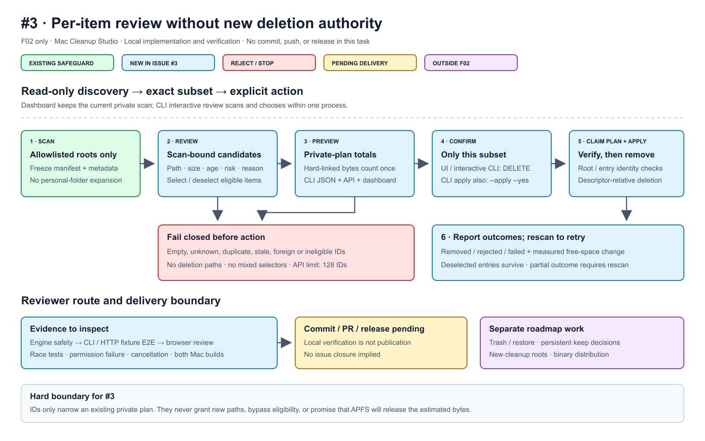

# Issue #3 — per-item review verification

Scope: F02 only, on `codex/issue-3-item-review`, based on
`a9f91004f271abd2c8599a9a826d3f966365b703`. Implementation is local; this report
does not claim a commit, PR, release, or issue closure.



[Editable SVG](diagrams/issue-3-reviewer-roadmap.svg)

## Review order

1. `internal/cleanup/selection.go`: resolve IDs only against the private plan;
   return detached metadata and deduplicated metrics. The selection cannot
   expand compiled roots or make an ineligible item eligible.
2. `internal/cleanup/clean.go`: atomically claim the plan before mutation,
   filter exact candidates, retain root/entry preflight and descriptor-relative
   removal. Concurrent/reentrant calls see a consumed plan without deadlocking.
3. `internal/app/dashboard_service.go` and `internal/dashboard/server.go`:
   authenticated preview, current-scan ownership, strict request validation,
   128-ID ceiling, single-use outcomes and legacy bulk compatibility.
4. `cmd/mac-cleanup-studio/review.go` and dashboard assets: exact selection,
   visible metadata, totals from the engine, explicit confirmation. Existing
   bulk CLI commands remain available; interactive apply adds `DELETE`.

## Automated behavior coverage

All filesystem mutations use test-owned temporary directories.

| Boundary | Evidence |
| --- | --- |
| Deselection / immutable authority | Selecting B removes only B; A/C survive; changing public scan/preview metadata cannot redirect deletion. |
| Invalid / stale authority | Empty, duplicate, mixed selectors, unknown/path IDs, foreign engine/scan, ineligible items and replay fail closed. HTTP scan replacement invalidates prior IDs. |
| Overlap / accounting | Existing root-overlap rejection retained. One or both hard-link aliases count once; deselected aliases survive. |
| Changed entry / partial failure | A changed selected file is rejected while another valid selected file is removed. A read-only candidate fails while a second selected candidate succeeds; deselected data remains. |
| Cancellation / concurrency | Cancelled review input exits; cancelled cleanup removes nothing in its test; concurrent cleanup succeeds exactly once; callbacks may inspect consumed state. |
| CLI E2E | Parser → fresh scan → numbered subset → JSON preview/apply → real fixture deletion. EOF, empty/path/out-of-range/duplicate input and incorrect confirmation never delete. |
| HTTP E2E | Real loopback HTTP → scan stream → preview → clean stream → real fixture deletion; verifies UI item bytes against selection metrics and result totals; replay rejected. |
| API gate | Bearer token, origin checks, null/empty/duplicate/path/mixed selectors and 128/129-ID request bounds. |

Focused commands passed:

```text
go test -count=1 -v ./internal/cleanup -run 'TestCandidateSelection|TestNewRejectsRootsOutsideHomeAndOverlaps'
go test -count=1 -v ./cmd/mac-cleanup-studio -run 'TestInteractive'
go test -count=1 -v ./internal/app -run 'TestCandidateHTTPWorkflowEndToEnd'
```

The non-root permission failure test ran and passed; it was not skipped on
this machine. It skips only when run as root, where permission enforcement
would not exercise the intended failure.

## Browser review

The in-app browser exercised the real dashboard against a temporary fixture
service. No personal folders were scanned. The fixture contained two eligible
caches (32 KiB and 64 KiB) and one recent, ineligible cache (96 KiB).

- Scan rendered all three paths, sizes, modification ages, risks and reasons.
- Recent cache checkbox stayed disabled.
- Two selected candidates showed 96 KiB in the summary and cleanup dock.
- Deselecting the 32 KiB candidate showed one selected candidate and 64 KiB;
  the category checkbox became mixed.
- Cleanup stayed disabled until exact `DELETE` was entered.
- Clearing selection reset totals/count to zero and hid the cleanup dock.
- Screenshot inspection confirmed readable paths and metadata with no overlap.

The browser did **not** click permanent cleanup. Actual selected-file deletion
is covered by the CLI and HTTP E2E tests above, not claimed as a browser-click
result. The fixture server was stopped, its test data removed, and its temporary
harness excluded from delivery. Subsequent UI edits only clarified wording and
normalized indentation; syntax/build checks were repeated.

## Full verification — 2026-08-31

Test host: macOS 26.5, Apple Silicon; Go 1.25.5. Intel is cross-built here,
not runtime-tested. No signing/notarization, install lifecycle, older-macOS,
or physical APFS reclamation guarantee is claimed.

Literal final `make check` output:

```text
test -z "$(gofmt -l .)"
go vet ./...
go test -race ./...
ok  github.com/sraodev/mac-cleanup-studio/cmd/mac-cleanup-studio  2.377s
ok  github.com/sraodev/mac-cleanup-studio/internal/app           2.872s
ok  github.com/sraodev/mac-cleanup-studio/internal/cleanup       1.697s
ok  github.com/sraodev/mac-cleanup-studio/internal/cli           (cached)
ok  github.com/sraodev/mac-cleanup-studio/internal/dashboard     (cached)
go build -trimpath -o bin/mac-cleanup-studio ./cmd/mac-cleanup-studio
```

Fresh race run (no test cache):

```text
$ go test -count=1 -race ./...
ok  github.com/sraodev/mac-cleanup-studio/cmd/mac-cleanup-studio  1.307s
ok  github.com/sraodev/mac-cleanup-studio/internal/app           1.517s
ok  github.com/sraodev/mac-cleanup-studio/internal/cleanup       1.779s
ok  github.com/sraodev/mac-cleanup-studio/internal/cli           2.250s
ok  github.com/sraodev/mac-cleanup-studio/internal/dashboard     2.816s
```

These also exited 0 without diagnostics:

```sh
GOOS=darwin GOARCH=arm64 CGO_ENABLED=0 go build -o /dev/null ./cmd/mac-cleanup-studio
GOOS=darwin GOARCH=amd64 CGO_ENABLED=0 go build -o /dev/null ./cmd/mac-cleanup-studio
node --check internal/dashboard/static/app.js
go mod tidy -diff
xmllint --noout docs/diagrams/issue-3-reviewer-roadmap.svg
git diff --check
```

## Deliberate non-goals and limits

No new deletion roots, persistent exclusions/keep decisions, Trash/restore,
imported JSON execution, external service, or new dependencies. Directory
candidates remain indivisible scanned trees. API batches are capped at 128
candidates; a new scan is required after each applied batch. Modification age
does not prove a file is unused. Hard-link deduplication improves estimates;
unselected links, clones and snapshots can still retain physical blocks.
