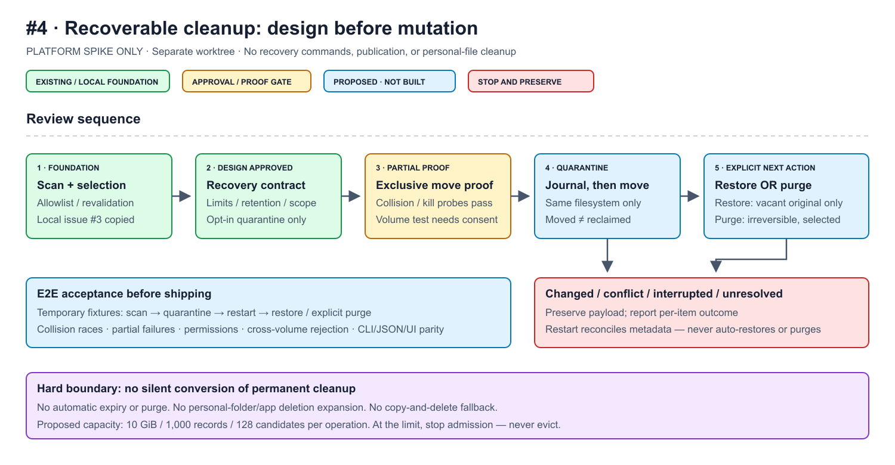

# Issue #4 — recoverable cleanup design proposal

Status: **Design approved by the user; implementation phase 1 in progress.**
Recovery commands remain blocked behind the platform-proof gate below.
This document covers F03 only. Approval does not authorize personal cleanup,
publication, or mounting a disposable test volume without operator consent.

Issue: [#4](https://github.com/sraodev/mac-cleanup-studio/issues/4).
Base: `a9f91004f271abd2c8599a9a826d3f966365b703`.
Branch: `codex/issue-4-recovery-design`, in a separate worktree.
Issue #3 remains uncommitted in its original checkout. Its source and tests
have been copied into this worktree as the implementation dependency; the
original checkout is untouched and nothing is published. The issue's copied
F04–F07 bullets remain separate work.

## Proposed decision

Add an **opt-in, bounded, app-owned quarantine** with explicit restore and
permanent purge. Do not silently change `clean` or `auto`. Do not use Finder
Trash as the recovery database. Do not add personal folders, app uninstall,
external volumes, background expiry, or arbitrary path inputs.

Quarantine is a safety option, not immediate disk-space relief. Same-filesystem
movement keeps the data allocated. Show moved logical/allocated bytes separately
from observed free-space change; only an explicit purge can remove the payload,
and snapshots/clones/hard links still prevent guaranteed physical reclamation.

### Policy choices for approval

| Concern | Proposed v1 decision |
| --- | --- |
| Supported storage | Local APFS on the home filesystem only; source and store device must match. Reject cross-volume, network and unsupported filesystems; no copy-and-delete fallback. |
| Source scope | Eligible candidates from the existing compiled cache/log/build-cache rules. Exclude the Trash rule, report-only rules, and recovery store. Keep age gates and scan revalidation. |
| Store | Fixed `~/Library/Application Support/Mac Cleanup Studio/Recovery`; never under cache/Trash roots. Reject symlinked or foreign-owned store ancestry. |
| Permissions | Store and record directories mode 0700; journal/manifest files mode 0600. Validate ownership, permissions and unexpected ACL access; refuse an unsafe store rather than changing existing user permissions silently. |
| Capacity | Proposed maximum 10 GiB accounted allocated payload bytes, 1,000 retained records, 64 MiB total store metadata, 128 candidates per operation. Require at least 64 MiB free for metadata admission; write required metadata before moving anything. This is not a reserved allocation; free-space errors can still abort. Never evict to make room. |
| Work bounds | At most 100,000 manifest entries and 16 MiB manifest data per operation; at most two minutes of active work, excluding user review. Exceeding a bound refuses that operation before mutation. |
| Retention | Show a review reminder after 30 days, but retain until the user explicitly restores or purges. At capacity, stop new quarantine operations. No timers or automatic deletion. |
| Restore conflicts | Original recorded location only. If occupied, parent missing/replaced/moved, source rule removed, or payload changed: leave payload in quarantine and report a conflict. No overwrite, auto-rename, parent creation or alternate destination in v1. |
| Permanent purge | Separate preview and explicit `--apply --yes`, plus `PURGE` in interactive/dashboard review. Only current store records selected by opaque ID; never purge unknown/orphaned payloads automatically. |
| Compatibility | Existing clean/auto behavior and JSON remain unchanged. Add capabilities and versioned recovery reports; do not reinterpret old scan reports as authority. |

The capacity is an accounting ceiling, not a disk reservation or a promise that
APFS extents are exclusively owned. Count independent record footprints
conservatively for admission; shared-data totals must be labelled. In-flight
and unresolved records count against limits. Enforce both global and per-operation
metadata limits, and refuse admission if
the store cannot be fully inventoried within its limits.

## Authority and filesystem operations

Quarantine consumes the current private scan's selected candidate IDs after
confirmation. Public JSON remains informational. Revalidate source parents,
device, recursive membership and entries immediately before moving. Use opened,
verified directory handles for source and destination; never reconstruct an
unchecked absolute path from a request or journal.

Store each record under a random identifier with a fixed payload basename.
Record rule ID, compiled-root identity, a validated single direct-child name,
source parent identity, source and post-move payload manifests, measured sizes,
timestamps and operation state. Do not accept arbitrary destination paths.
On later restore, resolve the rule through the **current compiled allowlist**
and validate the recorded parent identity. A journal is not permission to write
outside that allowlist. Purge can reach only the record's verified payload.

An exclusive store-wide process lock serializes mutation and reconciliation;
use a bounded wait with an explicit busy result, not an indefinitely waiting
command. Reads during mutation return a labelled snapshot or busy result.
Reject duplicate/replayed operation IDs and consume action plans once.

### Required platform proof before implementation proceeds

Ordinary rename is not a no-overwrite primitive: Go documents replacement of
an existing destination. `os.Root.Rename` inherits rename semantics. A separate
existence check would leave a race. [Go os documentation](https://pkg.go.dev/os#Rename)

Use a narrow Darwin descriptor-relative **exclusive rename** adapter only after
a fixture spike proves both file and directory behavior, collision handling,
symlink containment and availability on supported targets. The installed SDK
declares `renameatx_np` and `RENAME_EXCL`; header availability alone is not runtime
verification. The spike uses `golang.org/x/sys/unix` v0.35.0, preserving
CGO-disabled builds and avoiding custom syscall assembly. No
unsafe plain-rename fallback, shell `mv`, or copy/delete fallback is permitted.

Same-device rename semantics and `EXDEV` failure are documented by Apple.
Cross-volume handling in v1 is an explicit rejection, not an attempted copy.
[Apple rename manual](https://developer.apple.com/library/archive/documentation/System/Conceptual/ManPages_iPhoneOS/man2/rename.2.html)

Descriptor containment does not provide atomic “move only this fingerprint”
semantics. Repeat identity checks immediately before and after movement. If
the moved payload does not match, preserve it as unresolved; do not automatically
restore or purge it. An application may retain an open descriptor and modify
moved data. Tell users to close writers and do not claim a tamper-proof backup
against other processes running as the same user.

## Journal and interruption model

1. Validate selection, bounds, lock, source and destination store. Persist a
   versioned `prepared` record before moving payload. No metadata => no move.
2. Exclusive rename source to the fixed, vacant record payload; synchronize
   affected directory metadata, verify the resulting payload, then persist
   `quarantined`. Never report completion if a required durability step fails.
3. Restore persists `restore_pending`, performs an exclusive rename to the
   verified vacant original name, verifies the result and records `restored`.
4. Purge persists `purge_pending`, revalidates selected payload entries and
   removes through descriptor-relative operations. Interruption records
   `purge_partial`; clearly report that already-removed entries are unrecoverable.
5. A process restart reconciles **metadata only** under the lock. Inspect both
   source and payload using recorded identities, accounting for rename-induced
   metadata changes. If exactly one matches, repair the journal state. Both,
   neither, mismatch, unknown schema, or corrupted metadata => `unresolved`.
   Never move or delete data merely because the process restarted.

Implement fsync/atomic metadata replacement and validate filesystem durability
behavior in the spike. Process-kill recovery is required; do not equate it with
verified sudden-power-loss guarantees. Completed and interrupted records count
against metadata limits. An explicit `recovery forget --ids id,... --apply --yes`
may remove a terminal journal only after proving it has no remaining payload
and no pending operation. Refuse forget for unresolved or partially purged
records. No background deletion.

## CLI, JSON and dashboard proposal

- `quarantine --interactive [--apply --yes] [--json]`: fresh scan, candidate
  selection, preview; applying additionally confirms `QUARANTINE`.
- `recovery list --json`: read-only bounded inventory including unresolved and
  partially purged records, retention age and remaining capacity.
- `recovery restore --ids id,... [--apply --yes] [--json]`: dry-run default;
  revalidated original destinations, no overwrite. Interactive UI uses `RESTORE`.
- `recovery purge --ids id,... [--apply --yes] [--json]`: dry-run default;
  interactive UI uses `PURGE`, never a generic cleanup button.

IDs resolve through the local store, not imported manifests. Emit per-record
outcomes with stable machine-readable reasons: busy, limit, unsupported volume,
changed, destination conflict, interrupted, unresolved, partial purge. Keep
estimated selection, moved bytes, removed bytes, and observed volume change
distinct. Metadata contains private filenames: redact home prefixes in output,
do not log manifests by default, and do not upload anything.

The dashboard must be a client of the same core; keep bearer token/origin checks,
server-side preview totals and explicit confirmation. Recovery capability is
unavailable, with a reason, on unverified platforms. Initial verification target
is macOS 26.5 arm64; amd64 needs runtime evidence as well as cross-builds before
being advertised as supported for recovery.

## Acceptance and E2E gate

Run all mutation tests exclusively on temporary fixtures; cross-volume runtime
tests use a disposable mounted test volume only with explicit operator approval.
An injected EXDEV test is necessary but not a substitute for that runtime test.

| Scenario | Required observation |
| --- | --- |
| Full lifecycle | CLI and authenticated HTTP/UI: scan → subset → quarantine → restart → list → restore. Deselected files unchanged; restored contents/metadata checked. |
| Name collision | Existing file, empty/nonempty directory, symlink and a destination created during the rename race all remain unchanged; payload remains recoverable. |
| Parent / source change | Replaced/moved parent, changed entry, cross-device or symlink swap fails closed without redirecting a move. |
| Crash matrix | Kill before/after every durable journal step and rename; repeat reconciliation. No silent loss, duplicate action, automatic restore or purge. |
| Changed quarantine payload | Open-writer change, hard-link alias write, injected child or missing payload yields changed/unresolved; no stale authorization. |
| Limits / permissions | Full store, metadata write failure, disk exhaustion, wrong owner/mode/ACL, busy lock and cancellation preserve recoverable state; no privilege escalation. |
| Purge | Explicitly selected record only; partial purge accurately lists irreversible progress; replay never deletes unrelated entries. |
| Accounting | CLI/JSON/UI agree on selected/moved/removed estimates; movement is never marketed as reclaimed space. |
| Baseline | Existing permanent cleanup behavior, no-path authority, race tests and both architecture builds remain intact. |

## Delivery steps after approval

1. Integrate issue #3 and prove the exclusive-move/durability adapter on fixtures.
   If proof fails, stop and revise this design before any recovery API ships.
2. Build bounded store/journal with restart reconciliation and corruption tests.
3. Wire quarantine/restore/purge through the core and CLI; add full fixture E2E.
4. Add dashboard review, capabilities/docs and browser E2E; publish only with
   separate user authorization.

Current evidence is tracked in [the platform verification report](issue-4-platform-verification.md).
The adapter is not wired to any product command. Store permissions/ACLs, bounded
journal/reconciliation, recovery CLI/API/UI and their lifecycle E2E remain unbuilt.
The process-kill probe is not a production recovery journal or a power-loss test.
Baseline issue #3 tests are not evidence of recovery support.
