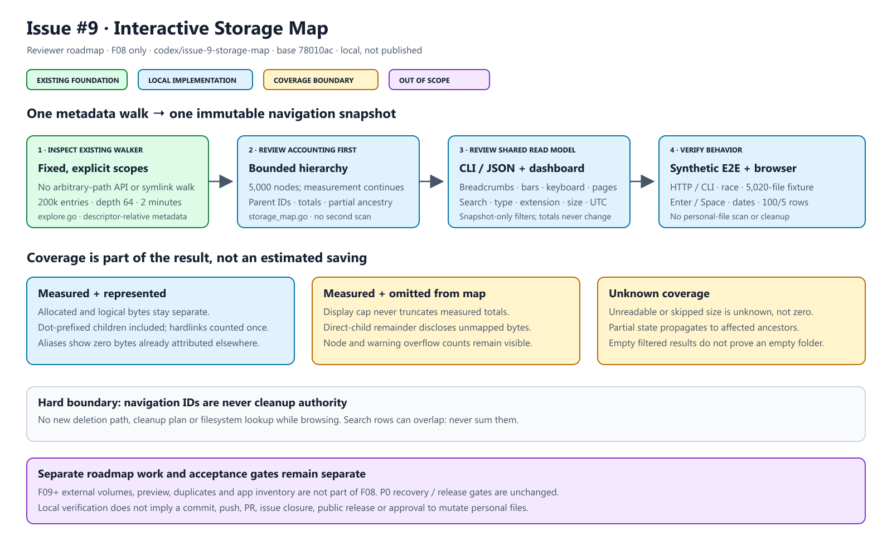

# Issue #9 — interactive storage map

Local work on `codex/issue-9-storage-map`, based on P0 commit `78010ac`.
F08 only: F09–F14 repeated in the issue body remain separate roadmap issues.



[Editable SVG](diagrams/issue-9-storage-map.svg)

## Shared read-only contract

The existing metadata explorer now emits `report.map_nodes`: navigation `id`,
`parent_id`, display path, kind, UTC modification time, metrics, partial flag,
and `unmapped_allocated_bytes` / `unmapped_logical_bytes`. `map-0` represents
selected scopes. IDs exist only within that report; they are not file identities
or cleanup IDs. No private deletion plan or arbitrary-path endpoint is added.

At most 5,000 map nodes are retained; `map_nodes_omitted` discloses the rest.
Measurement continues beyond the map cap, and measured-but-unmapped immediate
contents remain in folder totals. Existing traversal limits remain: 200,000
entries, depth 64, two-minute cooperative timeout and 100 warnings, now with
`warnings_omitted`. Partial coverage propagates to affected ancestors. Unknown
unreadable/skipped bytes are not guessed or presented as a measured zero.

Dot-prefixed names are included; their recorded immediate-child bytes are shown.
Hard-linked bytes count once at the first encountered location; later aliases
are zero-byte `hardlink` nodes. Attribution may vary between scans but never
changes while navigating/filtering one report. Allocated bytes are not promised
APFS savings. This is a bounded metadata observation, not a filesystem transaction.

## Navigation and filters

The original folder-bar visualization has numeric sizes, native folder buttons,
Enter/Space activation, breadcrumbs, Up, focus management and 100-row pages.
All navigation is local to the received snapshot; it makes no filesystem calls.
Changing folders clears filters. Filtering never changes measured totals.

Without filters, rows are immediate children. With filters, rows are matching
descendants: path search, type (`all`, `file`, `directory`, `hardlink`), exact
extension, inclusive logical-size minimum/maximum and own modification date.
Search and extension are case-insensitive. UTC after-date is inclusive; before
is exclusive. Unknown dates do not match. Zero maximum means unlimited.
Ancestor/descendant search matches may overlap: never sum search rows.

```sh
mac-cleanup-studio explore --scope downloads --map
mac-cleanup-studio explore --map --search report --kind file --extension .pdf --json
mac-cleanup-studio explore --map --map-min-mib 10 --map-max-mib 500 --modified-after 2025-01-01 --modified-before 2026-01-01
```

CLI map view starts at selected scopes; filters search descendants. `--limit`
bounds displayed rows to 1–200. JSON includes the full bounded hierarchy and a
`map_view` array, including empty results, when map/filter output is requested.
Large/old-file list thresholds and their existing output remain unchanged.

## Verification and review

Environment: macOS 26.5 arm64, Go 1.25.5. No Intel runtime claim.

```sh
make check
go test -count=1 -race ./...
go mod tidy -diff
node --check internal/dashboard/static/app.js
node --check internal/dashboard/static/map.js
git diff --check
```

Tests: recursive hierarchy, byte conservation, dotfiles, hard-link aliases,
immutable filters, exact size/date boundaries, empty/deep/partial trees,
cancellation, map cap and an actual 5,020-file traversal retaining full totals.
Real HTTP and CLI fixture E2E check JSON, authentication, path rejection,
unreadable coverage, recursive matching and map-ID rejection by cleanup.

Browser fixtures: nested 2 MiB PDF, 512 KiB text file, 1 MiB hidden file,
unreadable folder and 105 small files. Checks cover navigation/breadcrumbs,
Enter/Space, recursive search/type/extension/size/date filters, no matches,
100/5-row pagination, partial accounting and unchanged totals. Browser testing
prompted explicit single-activation keyboard handling. Tests do not scan or
clean personal files. The reviewer diagram is rendered and visually checked.

Review `storage_map.go`/`explore.go` accounting first, then CLI filter validation,
the text-only DOM renderer, and E2E/keyboard evidence. External volumes, previews,
duplicate hashing, app inventory and all personal-file mutations remain out of
scope. P0 recovery and release gates are unchanged. No commit, push, PR, issue
closure or release is implied by local verification.
