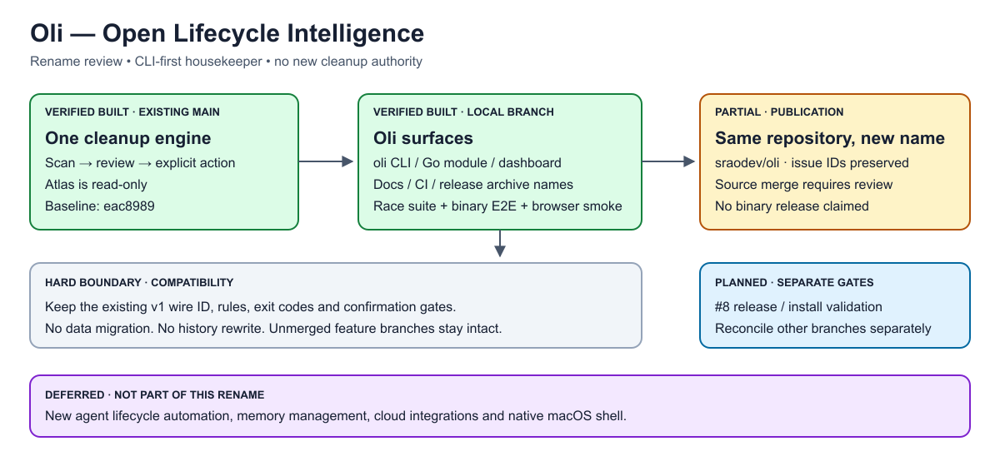

# Oli rename verification

Oli means **Open Lifecycle Intelligence**. Tagline: **Your machine’s housekeeper.**

## Review scope

Based on main `eac898975b31637e86ceb6907f22e2812a7bef50`, independently of
unmerged per-item, installer and P0 work. This change renames the CLI entrypoint,
Go module/imports, dashboard, documentation, CI outputs and release archive names.
The existing GitHub repository was renamed to `sraodev/oli` (same ID
`1351203093`); no history rewrite, issue recreation, source merge or release.



[Editable SVG](diagrams/oli-rename-reviewer-roadmap.svg), rendered and visually
checked. Green branch work means locally verified, not merged or released.

## Compatibility boundary

- Executable: `oli`; source entrypoint: `./cmd/oli`; capabilities product: `oli`.
- The existing `mac-cleanup-studio/v1` schema identifier is deliberately retained.
- Rule IDs, flags, exit codes, allowlists and confirmation gates are unchanged.
- No automatic binary/data migration or compatibility executable installation.
- Dashboard auth realm and session key use Oli; start a fresh session on upgrade.
- Old module names remain only in compatibility documentation/tests and explicitly
  historical test output. Historical source paths and commit identities stay intact.
- Other feature branches must reconcile this rename when integrated; this PR does
  not import their unrelated implementation or claim their features are shipped.

## Literal local results

2026-09-06: Go 1.25.5, macOS 26.5, Apple Silicon.

```text
$ go test -count=1 -race ./...
ok  github.com/sraodev/oli/cmd/oli                 3.234s
ok  github.com/sraodev/oli/internal/app            2.335s
ok  github.com/sraodev/oli/internal/cleanup        1.309s
ok  github.com/sraodev/oli/internal/cli            1.456s
ok  github.com/sraodev/oli/internal/dashboard      2.672s
```

`make check` subsequently passed format, vet, race tests and the `bin/oli` build.
`node --check internal/dashboard/static/app.js` and `git diff --check` exited 0.
Both commands below exited 0; `file` identified arm64 and x86_64 Mach-O executables:

```sh
GOOS=darwin GOARCH=arm64 CGO_ENABLED=0 go build -trimpath -o /private/tmp/oli-rename.rysoxG/oli-darwin-arm64 ./cmd/oli
GOOS=darwin GOARCH=amd64 CGO_ENABLED=0 go build -trimpath -o /private/tmp/oli-rename.rysoxG/oli-darwin-amd64 ./cmd/oli
```

## End-to-end coverage

`TestOliBinaryE2E` builds and invokes the actual renamed executable against a
temporary synthetic home: help/version, JSON capabilities, scan, recommendations,
clean dry run, refusal of each incomplete confirmation, then confirmed deletion
of exactly one synthetic cache. Preview/refusal paths assert fixture preservation.
Existing regression tests cover cancellation, partial results, changed files,
path confinement and HTTP confirmation/authentication failures.

Manual browser smoke used the actual `bin/oli dashboard --no-open` with a separate
synthetic home: Oli title/identity, authenticated ready state, scan of one fresh
cache excluded by its age gate, Downloads exploration showing one 52-byte fixture,
and authenticated reload through the renamed session key. No browser cleanup was
applied. This is manual smoke coverage, not an automated browser test suite.

Initial test attempts exposed a sandbox Go-cache restriction (rerun with access)
and an incorrect E2E assertion expecting file paths in recommendation summaries
(corrected to verify measured fixture bytes). Final results above passed.

Intel is cross-build-verified, not hardware-tested. No fresh-machine install,
signed/notarized release, restore workflow or native/TUI feature is claimed.
