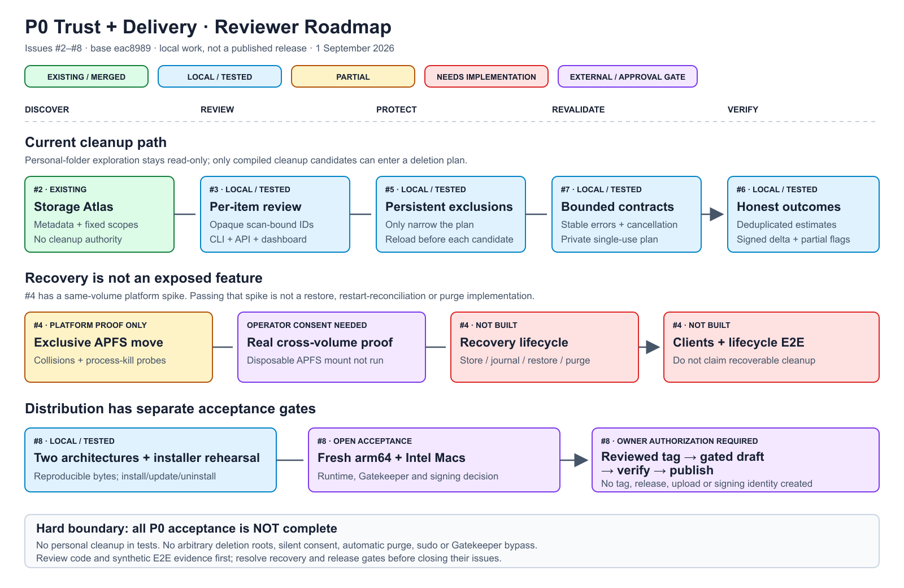

# P0 implementation and acceptance report

Scope: issues #2–#8. Branch `codex/p0-trust-delivery`, based on
`eac898975b31637e86ceb6907f22e2812a7bef50`. Verification date: 2026-09-01.
This report records local verification. Publishing the source branch does not
constitute a binary release or close the remaining GitHub acceptance gates.



[Editable SVG](diagrams/p0-reviewer-roadmap.svg)

## Acceptance matrix

| Issue | Current result | Remaining gate |
| --- | --- | --- |
| #2 Storage Atlas | Existing main implementation; regression tests retained | No new scope in this change |
| #3 Per-item review | CLI review, scan-bound IDs, API preview, dashboard selection and HTTP E2E | Source review/publication |
| #4 Recoverable cleanup | Approved design; exclusive-move platform spike and process-kill probes only | Explicit disposable-APFS consent, real cross-volume test; then store/journal/reconciliation/restore/purge, clients and lifecycle E2E |
| #5 Persistent exclusions | Fixed versioned config, exact path/rule and native alias matching, scan/recommend/mutation enforcement | Source review/publication |
| #6 Explainable reports | Byte vocabulary, global hard-link deduplication, incomplete flags, signed available-space change and partial outcomes | Source review/publication |
| #7 Agent contracts | Error codes, bounded records, cooperative cancellation, opt-in allowlisted diagnostics, documented future history contract | Source review/publication; no general history store added |
| #8 First release path | Deterministic two-architecture packaging, provenance/verifier, offline installer and gated workflow | Fresh-machine arm64/Intel acceptance, signing/distribution decision, protected environment, explicitly authorized first release/download verification |

All P0 acceptance is **not complete**. In particular, the existing clean command
still permanently deletes; it does not quarantine or offer restore. Do not
close #4 or infer release readiness from a green local test suite.

## Code review order

1. `internal/cleanup/selection.go`, `protection.go`, `scan.go`, `clean.go`:
   private authority, narrowing policy, record bounds and revalidation.
2. `internal/app/dashboard_service.go`, dashboard and CLI: selection totals,
   incomplete coverage, stable errors, partial mutation and signed observation.
3. `cmd/releasepack`, `scripts/install.sh`, release workflow: source/byte
   identity, safe replacement and fail-closed publication order.
4. The separate `internal/recovery` spike and its design. It is deliberately
   not imported into a user-facing mutation path.

## Automated evidence

Environment: macOS 26.5 arm64, Go 1.25.5. All deletion/install tests use isolated
temporary fixtures. HTTP E2E opens a temporary localhost listener; it required
permission outside the restricted runner sandbox. No personal cleanup occurred.

```sh
make check
go test -count=1 -race ./...
go vet ./...
go mod tidy -diff
test -z "$(gofmt -l .)"
node --check internal/dashboard/static/app.js
shellcheck scripts/install.sh
git diff --check
```

Tests cover:

- Real HTTP scan → exact candidate preview → cleanup → replay rejection.
  A newly added exclusion wins after review; corrupt policy emits a stable
  failure instead of a completed scan.
- CLI interactive review with protection added between scan and apply returns
  a single partial-result document and leaves the protected fixture intact.
- Whole-rule, nested/future paths, hard-link/native case/Unicode aliases,
  malformed/oversized config, symlink aliases, rename/revalidation, and policy
  changes before/between candidates. Removing policy never expands a frozen plan.
- Bounded scans retain only fully inspected candidates. Cross-rule hard links
  count once in final totals. Negative concurrent-space observations and rejected
  cleanup candidates remain visible instead of looking like complete success.
- Stable error mappings and opt-in diagnostic field allowlist; early usage
  errors do not echo private arguments to the public JSON envelope.
- Real arm64/amd64 compilation, deterministic duplicate builds, provenance and
  archive verification, default rejection of snapshots, tampered download
  rejection and no output-directory overwrite.
- Native install/version/update/uninstall in a canonical temporary directory;
  wrong version, missing replacement consent, bad checksum/archive, symlinked
  directory and missing uninstall confirmation all fail. Failed updates preserve
  the installed bytes; unrelated files survive uninstall.
- Publication script tested with local stubs: create/download/verification
  failures cannot reach public visibility. This does not exercise GitHub itself.

The recovery cross-volume test is explicitly skipped without
`MCS_RECOVERY_TEST_OTHER_VOLUME`. Process-kill tests are not sudden-power-loss
proof. The full recovery lifecycle and fresh-machine binary tests are absent,
not counted as passing coverage.

## Browser verification

Manual browser smoke checks used a temporary dashboard service with an 8 KiB
eligible fixture, 4 KiB protected fixture and invalid-directory warning. Passed:
incomplete-coverage heading/banner, disabled protected row/reason, authoritative
8 KiB one-candidate preview, clearing to zero selection, restoring low-risk
selection and disabled clean confirmation without `DELETE`. No browser console
errors/warnings appeared. The browser check caught and prompted a fix to a
leftover misleading completion heading. No permanent cleanup was clicked in
the browser; filesystem mutation is covered by automated HTTP E2E instead.
The fixture server was stopped and its temporary harness removed. All three
reviewer SVGs were rendered and visually checked; an overflowing P0 label was
corrected before handoff.

## Unchanged boundaries

Original issue #3 and #4 working directories are retained. Source commit/push
was authorized separately after local verification. That authorization does not
include issue closure, tags, releases, account setting changes or APFS image
mounts. No signing secrets, new cloud
dependencies, arbitrary deletion roots, automatic purge or background cleanup
are introduced.
