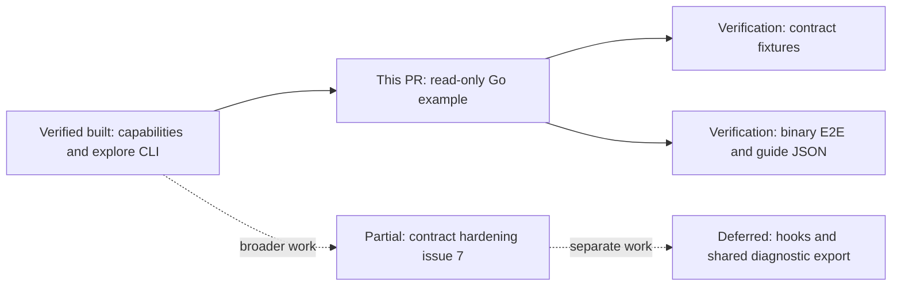
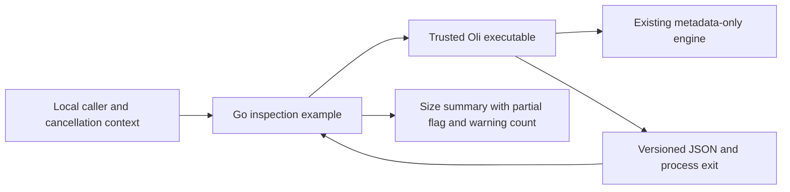

# Agent inspection example — scope and review

Implements [#57](https://github.com/sraodev/oli/issues/57), a bounded example under
the broader [#7](https://github.com/sraodev/oli/issues/7) contract-hardening work.

## Scope

- Runnable Go standard-library example linked from the existing agent guide.
- Version/capability negotiation, read-only fixed-scope inspection, process exit
  handling, deadline/cancellation, partial reporting and minimal JSON summary.
- Contract regression fixtures and binary E2E using only a synthetic home.
- Documentation fixture blocks are compared directly to actual example output.
- No CLI/engine changes, dependencies, cleanup, hooks, release or remote service.

The example is not a general JSON client, privacy scrubber or replacement for the
canonical [agent contract](../agent-interface.md). It accepts additive fields but
refuses unknown schema identifiers. It uses the current engine's bounded
exploration lists and warnings; the caller's 30-second deadline is stricter than
the CLI's two-minute exploration timeout.

## Reviewer roadmap



## Architecture and safety boundary



No edge leads to cleanup: only two hard-coded read-only invocations are made.
Filenames, raw subprocess diagnostics and warning messages do not enter the
summary. The CLI's trustworthiness is a prerequisite, not inferred from branding.

## Sequence

```mermaid
sequenceDiagram
  participant A as Example
  participant O as Oli
  A->>O: capabilities --json
  O-->>A: Exit status and versioned capabilities
  alt Unsupported schema or capability
    A->>A: Stop with error and no summary
  else Compatible read-only exploration
    A->>O: explore --scope downloads --limit 10 --json
    O-->>A: Exit status and report
    alt Failure, cancellation or deadline
      A->>A: Reject output and stop
    else Valid report
      A->>A: Validate envelope and preserve partial/warnings
      A-->>A: Emit size summary; never cleanup authority
    end
  end
```

## Verification boundaries

Run the example's contract tests, actual binary E2E, `make check`, an uncached
race suite and documentation-link validation. Record literal results against
the tested commit in the PR. The E2E complete and symlink-partial cases must
match guide JSON exactly and preserve the synthetic file.

Browser/terminal-keyboard, restore/collision and cloud-provider tests are not
applicable: no dashboard, TUI, recovery or provider integration changes. Existing
CLI tests still cover cancellation and confirmation refusal; new example tests
cover caller cancellation, deadline, child exit 130, malformed JSON, unknown
schemas, unsupported capabilities and partial reports. Tests never inspect or
delete the developer's own Downloads. No fresh-machine/release claim is made.
