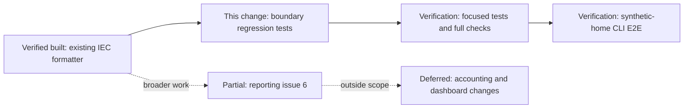
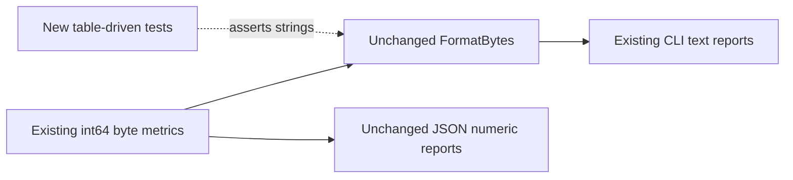
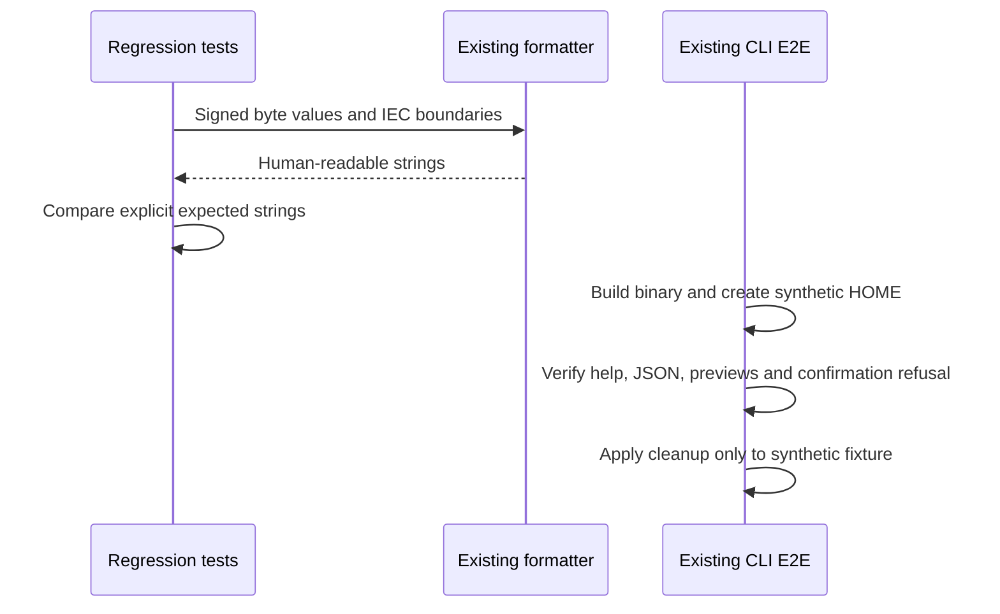

# Byte-format boundary regression scope

Issue: [#56](https://github.com/sraodev/oli/issues/56), supporting reporting parent
[#6](https://github.com/sraodev/oli/issues/6).

## Scope and presentation contract

Add table-driven tests for `internal/cleanup/format.go`; leave production code,
byte accounting, JSON contracts, dashboard formatting and cleanup authority
unchanged. No dependencies or runtime abstractions are added.

- Values below 1024 in magnitude use whole bytes; zero is `0 B`.
- Larger values use binary IEC units (KiB through EiB) with one decimal place.
- Negative observed changes retain their sign rather than being clamped to zero.
- Tests cover zero, byte values, rounding up/down, decimal-versus-binary inputs,
  all six unit boundaries on both sides, and both signed 64-bit extremes.
- Preserve established approximate display behavior: `1048575` displays as
  `1024.0 KiB`, because unit selection precedes decimal rounding. At the EiB
  boundary, float64 rounds `1152921504606846975` to the threshold, so it displays
  as `1.0 EiB`. These are presentation snapshots, not exact byte accounting.

No behavior change or bug fix was needed. The full reporting scope in #6 is not
completed by this test coverage.

## Reviewer roadmap

Review `format_test.go` against the unchanged formatter. Expected strings are
explicit, not derived by calling the formatter or copying its conversion loop.
Negative boundary checks exercise observed decreases. Extreme inputs ensure the
function remains bounded and does not overflow while handling the sign.

## Architecture boundary

## Verification sequence

## Acceptance verification

Run focused `TestFormatBytes` tests, `go test -count=1 ./internal/cleanup`,
`make check`, an uncached `go test -race -count=1 ./...`, and the existing
`TestOliBinaryE2E`. Record literal results and the tested commit in the PR.

Browser/keyboard E2E and new restore/collision/provider tests are not applicable:
this change only adds pure formatter tests and review documentation. The existing
CLI E2E still exercises preview preservation and incomplete confirmation failures
against a temporary synthetic home; it does not clean this Mac. No new cleanup,
release, platform-support or real-machine acceptance claim is made.
