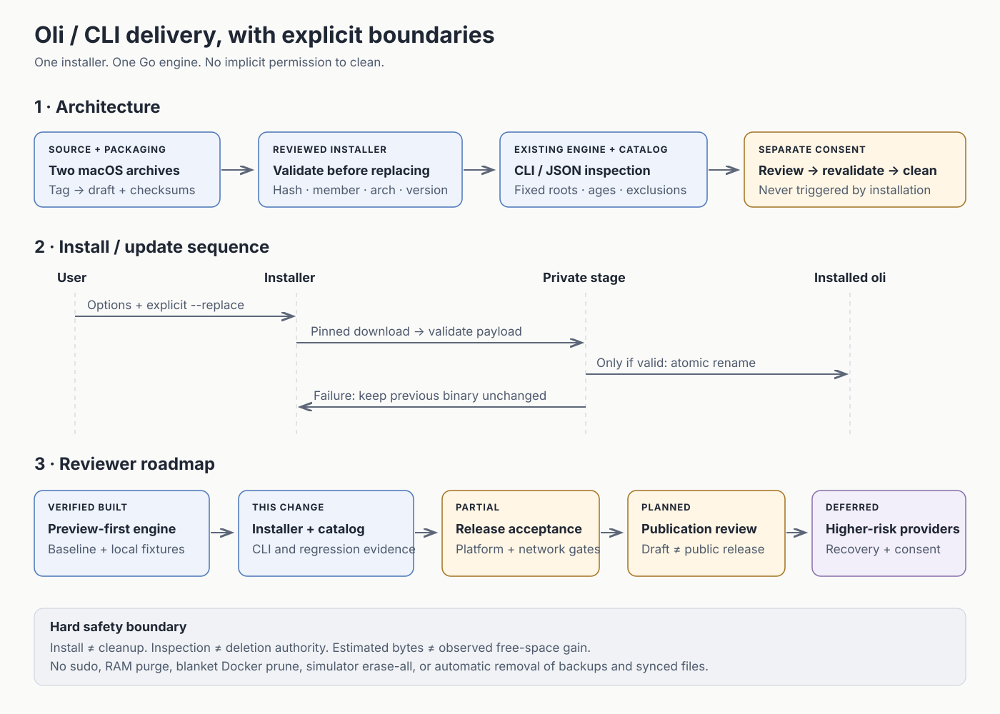
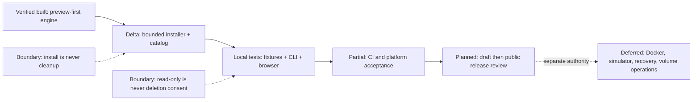

# CLI installer and bounded cleanup catalog

Base: `3e9328458000810387d3e85522c600d2c312642f` (main, before this change).

## Scope and review order

1. [Installer](../../scripts/install.sh): Bash 3.2, per-user install/update/uninstall,
   exact-version or once-resolved latest, bounded HTTPS downloads, SHA-256,
   one-file archive validation, native architecture and embedded version checks,
   same-filesystem replacement. [Fixture E2E](../../scripts/install_test.go).
2. [Packaging](../../scripts/package-release.sh) and
   [draft-only workflow](../../.github/workflows/release.yml): one canonical asset
   contract. No local uploads, signing account use or security-setting changes.
3. [Catalog](../../internal/cleanup/rules.go): manually selected aged logs,
   Android/pyenv download caches, report-only app caches and iOS packages.
   [Poetry exclusion](../../internal/cleanup/scan.go) prevents a broad cache scan
   from granting authority over its default virtual-environment directory.
4. [Regression tests](../../internal/cleanup/catalog_test.go),
   [CLI binary E2E](../../cmd/oli/e2e_test.go),
   [README](../../README.md), [installation guide](../guides/installation.md),
   and the [complete request coverage matrix](../guides/cleanup-coverage.md).

Related: #8, #16, #17, #44, #50, #70, #73. These issues are not closed by this
subset. #71 Docker, #72 Gems, #74 simulator resets and #75 mounted-volume Trash
remain separately reviewed operations. No other open PR is merged here.

## Invariants and non-goals

- Installation never runs cleanup, starts an agent/service, edits a profile,
  uses sudo, changes Gatekeeper or invokes a package manager.
- An existing `oli` is overwritten only with `--replace`; any validation failure
  preserves its bytes. Uninstall removes only the expressly selected regular file.
- Digest validation is integrity against the same publisher, not independent
  authentication. The installer script itself is reviewed/trusted code.
- New destructive roots are narrow, user-scoped, nonautomatic and age-gated;
  scan-only actions remain rejected even with CLI deletion confirmation.
- File estimates are not a promised disk-space gain. No personal data was used
  for destructive tests. Protected/excluded paths do not become reclaimable bytes.
- No full-disk/system cleanup, whole module-cache removal, dependency pruning,
  app uninstall, synced-data deletion, RAM purge, fake speed claim, Linux support,
  or new Homebrew/bun/PowerShell/mise channel.
- Source changes, local candidates, CI results, draft assets and public releases
  are different states. The README must not advertise an untested live installer.

## Original diagram preview



Editable semantic sources follow. The SVG is a condensed review aid, not a claim
that every requested cleanup provider has shipped.

## Architecture

```mermaid
flowchart LR
  Tag[Reviewed source tag] --> Pack[Package two macOS archives]
  Pack --> Draft[Draft release + SHA256SUMS]
  Draft -. publication gate .-> Public[Public release]
  Public --> Installer[Reviewed Bash installer]
  Local[Manually obtained assets] --> Installer
  Installer --> Verify[Hash + member + architecture + version]
  Verify --> Rename[Atomic per-user binary replacement]
  Rename --> CLI[Oli CLI / JSON]
  CLI --> Rules[Existing engine + bounded catalog]
  Rules --> Preview[Read-only findings / immutable plan]
  Preview --> Consent[Separate explicit cleanup consent]
```



## Sequence

```mermaid
sequenceDiagram
  actor User
  participant Installer
  participant Release
  participant Stage as Private destination staging
  participant Target as Installed oli
  User->>Installer: Reviewed script + options
  Installer->>Installer: Validate OS, path and overwrite consent
  alt Preview
    Installer-->>User: Describe operation; no writes or downloads
  else Install/update
    Installer->>Release: Resolve once; download pinned manifest + archive
    Release-->>Stage: Bounded HTTPS assets
    Installer->>Stage: Validate hash, regular member, architecture, version
    alt Any validation failure
      Installer-->>User: Fail; leave existing oli unchanged
    else Verified
      Stage->>Target: Same-filesystem rename
      Installer-->>User: Version, path, no cleanup performed
    end
  end
```

## Reviewer roadmap



## Verification record

Environment: macOS 26.5, arm64, Go 1.25.5, `/bin/bash` 3.2. Automated destructive
tests operate only on generated fixtures. Exact tested commit and literal command
results are recorded in the PR after commit; working-tree checks alone do not
claim remote CI or published release acceptance.

The installer suite covers native install → help/version → explicit replace →
uninstall; preview, paths with spaces, duplicate/missing/wrong checksums, extra/
duplicate/traversing archive members, symbolic/hard links, wrong payload type/architecture,
embedded version mismatch, symlinked destination/ancestors, writable directories,
invalid versions/paths, repeat install/uninstall, a different-version upgrade,
and preservation after failures.
Catalog tests cover protected app data, fresh entries, fixed-root age gates,
scan-only refusal, frozen exclusions and byte/selection boundaries. Binary E2E
covers CLI/JSON preview, incomplete confirmation and fixture-only applied cleanup.

Remaining acceptance: live HTTPS/latest-release resolution, network-failure and
interruption/low-disk fault injection, native
Intel/Rosetta/minimum-macOS results, signed/notarized delivery decision, and the
unmerged P0 cancellation/reporting work (including #68). Do not describe these as
passed or close #8/#44 based on this PR. No public release is created by a local
package command. Browser fixture E2E exercises the existing UI; no TUI, cloud,
recovery or native-app acceptance is claimed.
