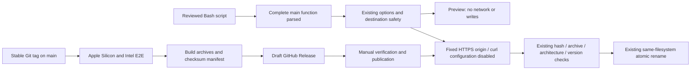
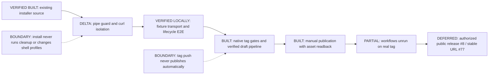

# Curl bootstrap review

Scope: harden the existing single-binary macOS installer for piped Bash execution
and gate GitHub-hosted binary releases on native acceptance and asset verification.
Related: #8, #44, #50, #77, #79. No release, package channel, domain or service is published.

## Review order and boundaries

1. [Installer](../../scripts/install.sh): guarded entry point, explicit curl
   configuration isolation, useful missing-release error, `--install-dir` alias
   and explicit `--no-modify-path` compatibility. Keep `--bin-dir` working.
2. [Fixture E2E](../../scripts/install_test.go): feed the script through stdin;
   substitute only transport in a test copy, never expose an alternate production
   release origin. Existing archive/identity/atomic replacement checks remain.
3. [Installation guide](../guides/installation.md) and [README](../../README.md):
   public preview is not a published binary-install channel.
4. [Tag build](../../.github/workflows/release.yml),
   [asset verifier](../../scripts/verify-release.sh) and
   [manual publish](../../.github/workflows/publish-release.yml): two native
   architecture gates before draft creation, exact draft asset readback before
   manual publication, then public-byte readback.

No daemon, PATH/completion edits, automatic replacement, hooks, cleanup, sudo,
Linux support, signing claim or new dependency. The single `oli` executable
remains the installation unit. Same-origin checksums do not independently
authenticate the publisher. Script contents must be reviewed/trusted.

## Architecture



## Sequence

```mermaid
sequenceDiagram
  actor Maintainer
  actor User
  participant Actions
  participant Bash
  participant GitHub
  participant Stage as Private staging
  participant Binary as Installed oli
  Maintainer->>Actions: Push reviewed stable tag
  Actions->>Actions: Native arm64 and Intel tests, package, verify
  Actions->>GitHub: Create draft with four assets
  Maintainer->>Actions: Explicit manual publish dispatch
  Actions->>GitHub: Download draft; compare to tag source and checksums
  Actions->>GitHub: Publish, then read back public bytes
  User->>Bash: Script on stdin, options
  Bash->>Bash: Parse complete main body, validate options
  alt Dry run
    Bash-->>User: Preview without downloads or writes
  else Install or explicit update
    Bash->>GitHub: Resolve latest once (unless version pinned)
    GitHub-->>Bash: Exact stable tag or failure
    Bash->>GitHub: Download pinned manifest and archive
    GitHub-->>Stage: Bounded HTTPS bytes
    Bash->>Stage: Verify hash, member, architecture and version
    alt Failure
      Bash-->>User: Error; old binary preserved, staging cleaned
    else Verified
      Stage->>Binary: Atomic replacement with explicit overwrite consent
    end
  end
```

## Reviewer roadmap



## Verification

- Native fixture E2E: `go test ./scripts -run TestInstallerE2E -count=1` passed
  on macOS arm64 (16.921s). Initial sandbox run failed to load Go's standard
  library; rerun with build-cache/test-directory access passed.
- New coverage: stdin execution, truncated function rejection, no-write/no-network
  preview, directory alias, latest resolved once, pinned-version bypass of latest,
  HTTPS/timeout/curl-disable arguments, failed latest lookup, unexpected redirect,
  simulated timeout/partial transfer/corruption, unchanged old binary and staging
  cleanup, update and uninstall. Existing malformed archive/identity tests also ran.
- Transport failure fixtures are simulated curl responses, not a live TLS server
  or an elapsed network-timeout measurement. No real release install was tested.
- Public source readback on 2026-09-24 matched reviewed `origin/main` bytes:
  SHA-256 `74cff6ee4e6d2cd2e3040d9a06db5b31b030a7ce7ab6ba466d4feac18f68ef6e`.
  That source predates this change; this is not proof these changes are published.
- Public curl-to-Bash `--dry-run` preview passed: Darwin arm64 destination,
  no downloads or writes. This ran the reviewed public script, not the local delta.
- `bash -n scripts/install.sh`, `git diff --check` and checks of 32 local
  documentation links/anchors and balanced code fences passed.
- `make check` passed: clean formatting, `go vet ./...`, uncached race tests
  across all six packages (including CLI and installer fixture E2E), and binary
  build. Installer race-test package completed in 41.920s. No browser UI changed.
- No binary release was listed on 2026-09-24. Publication, downloaded asset
  acceptance, native Intel/Rosetta/minimum-macOS and low-disk/interruption gates
  remain separate. Do not close #8/#44/#77 based on fixture success.
- Release packaging and exact-asset verification passed locally for a synthetic
  `v0.1.0` candidate from the current checkout. This is neither a tag nor a
  published release. The tag and manual-publish workflows have not run remotely.
- The locally packaged arm64 candidate completed install, version readback,
  explicit update and uninstall in a fresh temporary directory; the test
  directory was removed afterward. This did not exercise Intel hardware or
  public GitHub downloads.
- `TestReleaseAssetsE2E` passed with real macOS arm64/amd64 packaging and
  rejects an extra checksum entry or a tampered installer. Bash syntax checks,
  YAML parsing for both workflows, `git diff --check`, and a fresh `make check`
  (format, vet, uncached race tests and build) passed on 2026-09-24.
