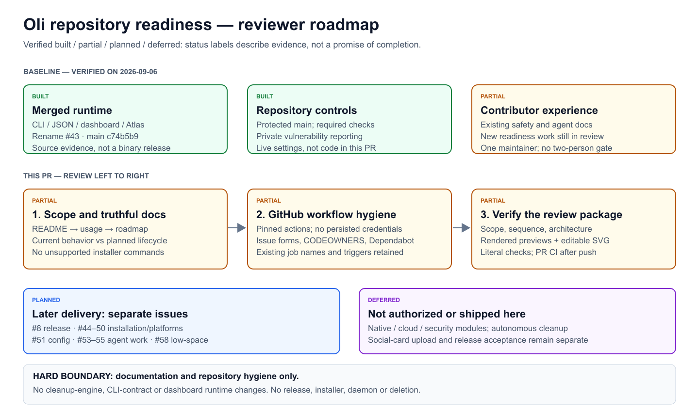
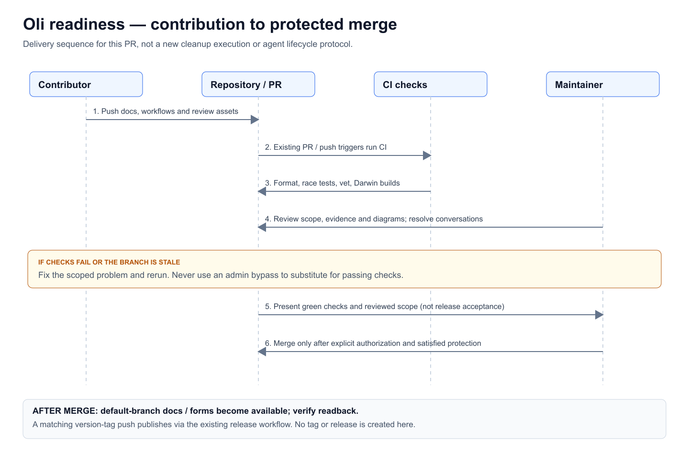
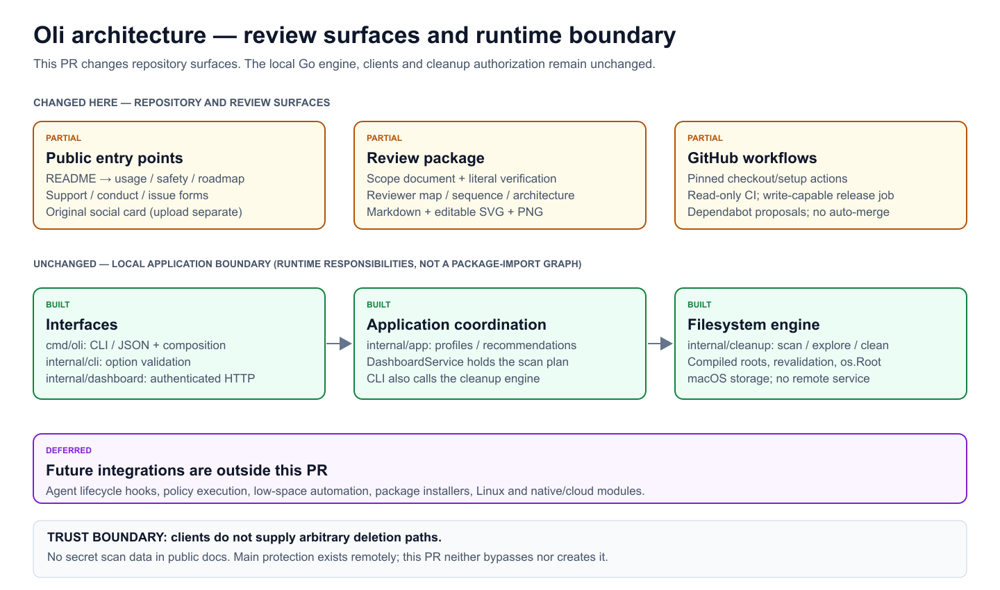

# Repository readiness — PR scope

Related issue: [#52](https://github.com/sraodev/oli/issues/52).
Branch: `feature/repository-readiness`.
Baseline: merged rename [#43](https://github.com/sraodev/oli/pull/43),
`c74b5b9966b4a787a9d40420c60c284870600030` on main.

## Outcome

Make Oli's current purpose, safe starting path, contribution process and review
boundaries understandable. Harden dependency references in the existing GitHub
workflows without changing runtime behavior or publishing a release.

Oli means **Open Lifecycle Intelligence**. Its current ecosystem is local
developer workspaces on macOS, with CLI/JSON integration for scripts and agents.
Storage growth is the present bottleneck. Agent-aware lifecycle management is a
future direction, not an implemented enterprise control plane or RAM cleaner.

## Included

- Refined README introduction and clear implemented-versus-planned positioning.
- User guide, doc index, canonical-roadmap links, support and community conduct.
- Private-report routing, focused issue forms, CODEOWNERS and contributor links.
- Full-SHA action references, disabled persisted checkout credentials,
  job-scoped release write permissions and weekly action-update proposals.
- Original social card, scope document and three editable/rendered diagrams.
- Contributor/PR-template guidance for review documents and applicable diagrams.

## Excluded

- No changes under `cmd/`, `internal/`, `go.mod` or `Makefile`; no new dependency.
- No cleaner rule, candidate selection, protocol, UI runtime or recovery change.
- No installer, Linux support, agent hook, low-space daemon, cloud connection,
  native app or centralized enterprise lifecycle system.
- No new release/tag, package publication, signing/notarization or social-card
  settings upload. A rendered asset is not a configured repository preview.
- No migration/removal of installed binaries, personal files or local drafts.

The existing source release workflow still publishes on a matching version-tag
push. This PR does not add an environment-approval gate. Maintainer authorization
before tagging remains a separate procedural requirement tracked in #8.

## Ordered reviewer route

| Order | Review | Verify |
| --- | --- | --- |
| 1 | [README](../../README.md), [usage](../guides/usage.md), [roadmap](../../ROADMAP.md) | Accurate purpose, commands and safety/status language |
| 2 | [Support](../../SUPPORT.md), [conduct](../../CODE_OF_CONDUCT.md), [forms](../../.github/ISSUE_TEMPLATE) | Private data stays private; contribution scope is bounded |
| 3 | [CI](../../.github/workflows/ci.yml), [release](../../.github/workflows/release.yml), [Dependabot](../../.github/dependabot.yml) | Pins, permissions, unchanged required names and triggers |
| 4 | [Security](../../SECURITY.md), [release guide](../maintainers/releasing.md) | Live settings distinguished from PR source and remaining gates |
| 5 | Diagrams below and [verification](repository-readiness-verification.md) | Readable originals; literal tests and explicit non-applicable coverage |

## Review documents and diagrams

The SVG files are the canonical editable diagram sources. PNG files are rendered
previews; no diagram framework is added to the project. Status words accompany
colors. Arrows describe the labeled workflow or responsibility, not hidden
execution authority.

### Reviewer roadmap

[Editable SVG](repository-readiness/reviewer-roadmap.svg)

### Sequence — contribution through protected merge

[Editable SVG](repository-readiness/sequence.svg)

### Architecture — changed surfaces versus unchanged runtime

[Editable SVG](repository-readiness/architecture.svg)

## Invariants and failure behavior

- CLI deletion still requires both explicit flags; dashboard action still needs
  its completed scan and exact confirmation. Neither docs nor recommendations
  create deletion authority. Current cleanup is permanent.
- The v1 wire compatibility identifier remains unchanged. No brand-config
  abstraction or runtime safety override is introduced; that work is #51.
- Failed/stale checks block normal merge; do not use an admin bypass to make a
  PR look ready. Required check names are unchanged.
- Action update proposals are reviewed like other code; Dependabot does not
  authorize an update or automatically merge it.
- A private vulnerability is not routed to a public issue. Ordinary reports use
  synthetic data and omit tokens, sensitive launch URLs and personal filenames.
- An absent release/install channel is documented as unavailable, not represented
  by a fake button, placeholder command or working-looking domain.

## Qualification and rollout gates

Before push: run format/vet/race/build, real-binary fixture E2E, static YAML/link
checks and visual review. After push: inspect required PR CI at the exact head.
After an explicitly authorized merge: verify default-branch forms, docs and
community-profile behavior. This PR alone does not complete all of #52.

Main protection and private reporting were enabled separately before this PR.
Readback on 2026-09-06 confirmed strict required quality/Darwin checks bound to
GitHub Actions, admin enforcement, no force pushes/deletion and resolved
conversations. Independent approval count is zero for the sole maintainer.
These controls are not an independent security audit.

The live desktop disk-space monitor is outside the repository. It is not a
shipped Oli daemon or proof that low-space feature #58 is implemented.
