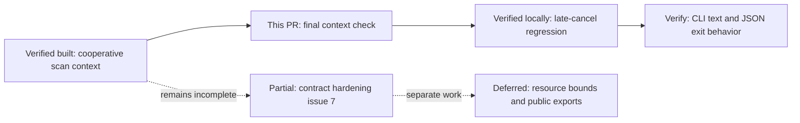
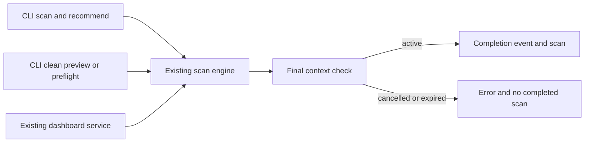

# Scan cancellation boundary — scoped P0 integration

Related to [#7](https://github.com/sraodev/oli/issues/7). This narrow change does not
close the broader contract-hardening issue.

## Scope and provenance

Port only the final context check from the unmerged
[P0 scan implementation](https://github.com/sraodev/oli/blob/78010ac73cec4b070dbc902b5fb2f2ed7e8d967f/internal/cleanup/scan.go).
Keep the current engine, wire format, clients and cleanup confirmation rules.
No unrelated branch commits, diagnostic export, exclusions, installer, UI or
resource-limit changes are included.

## Reproduction and behavior

Use one synthetic cache candidate and one rule. Cancel the scan context from the
last `candidate_scanned` or `rule_completed` callback. Before the fix, both cases
returned a completed scan with no error and emitted a misleading completion event:

```text
cancelled=true error=<nil> scan returned=true completion event=true
```

After the fix, the engine returns `context.Canceled`, no scan, and no
`scan_completed` event. The final context check is the success boundary. A
cancellation triggered inside `scan_completed` is too late to retract success;
a separate regression test preserves that ordering.

The fix adds three production lines. It does not change mutation paths or make
cancellation preemptive. A pending filesystem call or metrics calculation can
still delay observing cancellation. Runtime/output/record bounds remain broader
#7 work, not capabilities delivered here.

## Reviewer roadmap



## Architecture boundary



Shared-engine consumers inherit the check; no new client state or policy engine
is introduced. No HTTP or browser rendering behavior is changed in this patch.

## Sequence

```mermaid
sequenceDiagram
  participant S as Scan engine
  participant C as Progress callback
  participant A as Caller
  S->>C: Final candidate or rule progress
  C->>C: Cancel caller context
  C-->>S: Return
  S->>S: Final ctx.Err check
  S-->>A: Cancellation error and nil scan
  Note over S,A: No scan_completed event; prior progress is not success
```

## Verification plan

- Engine regressions: cancel at final candidate/rule events, expired deadline,
  and cancellation inside the completion callback; assert fixture preservation.
- CLI contract regressions: scan, recommend and clean preview, text and JSON,
  cancelled/deadline contexts; assert exit 130/1, stderr diagnostic, empty stdout
  and unchanged synthetic file.
- Full formatting, vet, build and uncached race tests; existing binary E2E for
  normal JSON reports, previews, confirmation refusal and fixture-only cleanup.
- Record literal test results and tested commit in the PR.

Late cancellation is reproduced deterministically through synchronous engine
callbacks, not a timing-dependent OS-signal race. The CLI contract tests exercise
the real dispatcher with pre-cancelled/expired contexts. The existing binary E2E
does not claim to reproduce that late callback race across a process boundary.

No browser UI, keyboard flow, provider, or recovery code changes; new browser,
keyboard, fake-provider and restore/collision E2E are not applicable. Existing
dashboard/service tests still run. No personal cleanup, release or new platform
acceptance is claimed.
