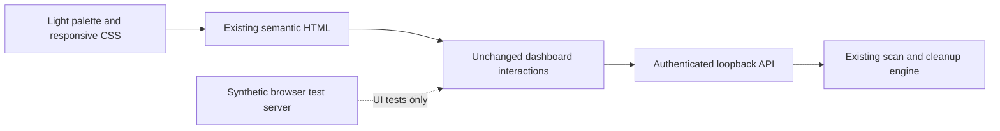
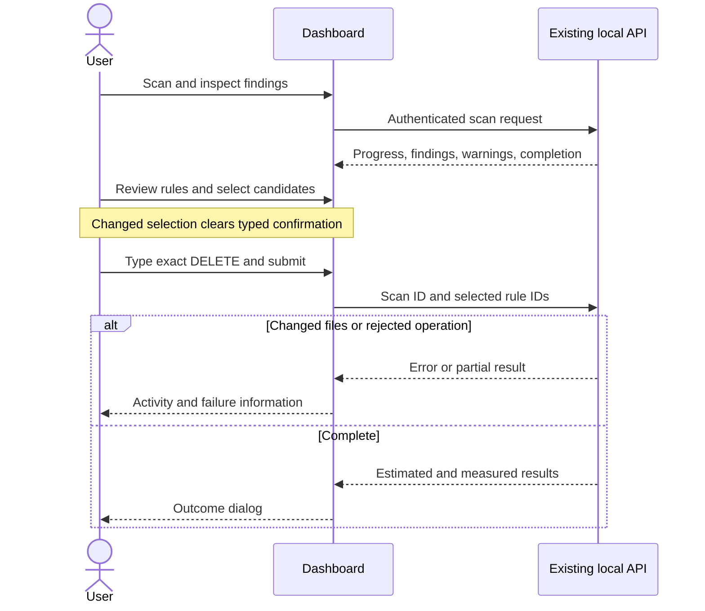
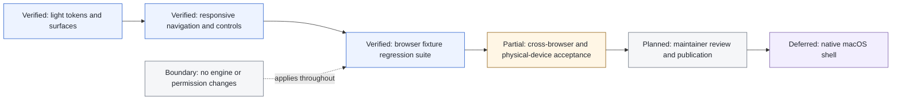

# Silver dashboard refinement

## Scope

Refine the existing local dashboard with pearl/paper surfaces, graphite text,
blue accents, subtle translucent navigation and confirmation chrome. Increase
small text and control sizes, retain navigation on tablets/phones, wrap safety
labels instead of truncating them, and support short landscape windows.

This is presentation work, not new cleanup functionality. No new runtime
dependencies, external fonts, artwork, analytics, hosted services, or branded
reference screenshots. All screenshots used for validation contain synthetic
data, not measurements of the user's Mac.

## Safety boundary

The Go engine, API contracts, authentication, loopback binding, security headers,
scan profiles, risk defaults, cancellation, and exact DELETE confirmation are
unchanged. Discovery-only findings remain unselectable. Estimates remain distinct
from measured reclaimed space. No real cleanup is executed by the browser suite.

## Architecture



## Interaction sequence



## Reviewer roadmap



## Verification

Base: `634e987c9878995a7a6add7e336ed007e081d3ce` (`origin/main`).
Results below describe the local working-tree changes, not a published binary.

Go validation:

```text
go test -race ./...
ok github.com/sraodev/oli/cmd/oli
ok github.com/sraodev/oli/internal/app
ok github.com/sraodev/oli/internal/cleanup
ok github.com/sraodev/oli/internal/cli
ok github.com/sraodev/oli/internal/dashboard

go vet ./...                         exit 0
test -z "$(gofmt -l .)"             exit 0
go test -count=1 ./cmd/oli -run TestOliBinaryE2E -v
--- PASS: TestOliBinaryE2E
PASS
```

Browser runner: `tools/dashboard-ui-e2e.cjs`. Requires Node and Playwright supplied
by the developer environment; no browser dependency is added to the Go binary.
Use `BROWSER_CHANNEL=chrome` for installed Chrome. For a nonlocal Playwright
installation set `NODE_PATH` to its package directory. Optional `ARTIFACT_DIR`
writes full-page and viewport screenshots of fixtures.

```sh
BROWSER_CHANNEL=chrome node tools/dashboard-ui-e2e.cjs
```

```text
PASS 1440px: navigation, findings, confirmation dock, no page overflow
PASS 1024px: navigation, findings, confirmation dock, no page overflow
PASS 768px: navigation, findings, confirmation dock, no page overflow
PASS 390px: navigation, findings, confirmation dock, no page overflow
PASS 320px: navigation, findings, confirmation dock, no page overflow
PASS short landscape: confirmation remains in document flow
PASS locked session, keyboard profiles/disclosure, explicit confirmation, selection reset, changed-file failure, cancellation, outcome dialog, no script errors
```

Visual review: desktop and phone screenshots inspected. Browser checks use
headless Chrome with reduced motion. The fixture server validates the submitted
confirmation and rule IDs, simulates changed-file rejection and a successful
outcome, and never accesses cleanup paths. The existing Go suite separately tests
the real API and engine. Safari, physical touch devices, and a full accessibility
audit remain unverified; this runner is not yet a CI-required check.
